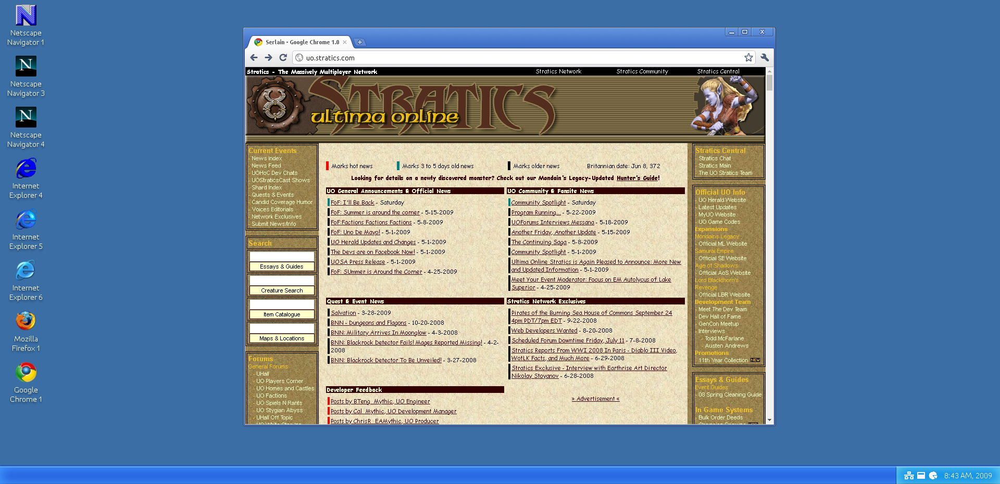

# Serlain
Serlain is a third-party web-based front-end for the [Internet Archive](https://archive.org/)'s [Wayback Machine](https://archive.org/web/). It displays archived web sites from the Wayback Machine in a mock browser that mimics how a typical user's browser might have looked like at the time the site was archived.

For instance, a web site archived in 1999 will be displayed in a mock browser that looks like Microsoft's Internet Explorer 4, and a page from 1996 in a mock of Netscape Navigator 1. (The rendering of the archived site's HTML will still be handled by your real browser inside an \<iframe\> element.)

You can view a live version of Serlain [here](https://www.tarpeeksihyvaesoft.com/experimental/serlain/).


# Usage
*(Coming)*

## Building
Serlain depends on [Babel](https://babeljs.io/) for transpilation of JSX. You can install the required dependencies by executing the following in the repo's root:
```
$ npm install @babel/core @babel/cli @babel/preset-react babel-preset-minify
```

Once you have Babel installed as per above, you can build Serlain with:
```
$ ./build-dev.sh
```

This will place the built distributable files inside the [distributable/](./distributable/) directory

## Deploying

The app's content is static except for some PHP 7.0-level code.

Regardless of your method of deployment, make sure to complete the [build steps](#building) before deploying.

### PHP 7-capable server

Copy all files from the [distributable/](./distributable/) directory to where you want the app to live on the server, and you should be done.

### Heroku

The repo also comes pre-configured for pushing to Heroku as a PHP node. Follow Heroku's instructions at [https://devcenter.heroku.com/articles/getting-started-with-php](https://devcenter.heroku.com/articles/getting-started-with-php).

### Server without PHP

The reason PHP is used in Serlain is to get around the fact that the Wayback Machine API doesn't appear to allow CORS. So as a workaround, the client-side Serlain makes a request to the server-side PHP script, which makes a corresponding request to the Wayback Machine API (bypassing CORS restrictions), then returns the response to the Serlain client.

Another possible workaround would be to use a CORS proxy, thus removing the need for PHP and allowing Serlain to be hosted fully statically. Commit [a2e39ee](https://github.com/leikareipa/serlain/commit/a2e39eec3df6b8647ecaf81b67f02c46ce233d85) made the required changes to use a CORS proxy instead of PHP; while the later commit [04f8ad4](https://github.com/leikareipa/serlain/commit/04f8ad48f7cec035e7e161ea6ebf9678c51888d0) undid those changes (because the particular proxy had some availability issues from time to time).

In short, if you want to host Serlain on a non-PHP server, you'll need to make some changes to the app's code, perhaps reproducing the commit mentioned above.

# Screenshots


