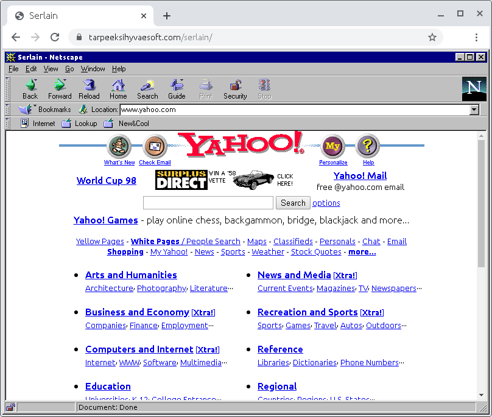

# Serlain
Serlain is a third-party web-based front-end for [Internet Archive](https://archive.org/)'s [Wayback Machine](https://archive.org/web/). It displays archived web sites from the Wayback Machine in a mock browser that mimics how a typical user's browser might have looked like at the time the site was archived.

For instance, a web site archived in 1999 will be displayed in a mock browser that looks like Microsoft's Internet Explorer 4, and a page from 1996 in a mock of Netscape Navigator 1.

The rendering of the archived site's HTML will still be handled by your real browser inside an \<iframe\> element.

# Screenshots
\
**Serlain in Chrome 78** displaying a 1999 capture of `www.3dfx.com` inside a mock of Internet Explorer 4.

\
**Serlain in Chrome 78** displaying a 1998 capture of `www.yahoo.com` inside a mock of Netscape Navigator 4.

# Usage
*(Coming)*

## End-user
*(Coming)*

## Developer
*(Coming)*

### Building
Serlain depends on [Babel](https://babeljs.io/) for transpilation of JSX. You can install the required dependencies by executing the following in the repo's root:
```
$ npm install @babel/core @babel/cli @babel/preset-react babel-preset-minify
```

Once you have Babel installed as per above, you can build Serlain with:
```
$ cd .build
$ ./build-dev.sh
```

This will place the built distributable files inside the repo's [dist/](dist/) directory

### Hosting
*(Coming)*

# Project status
*(Coming)*
